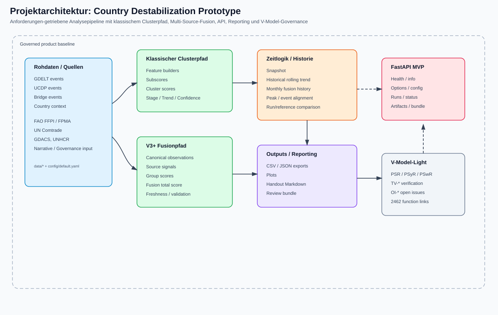
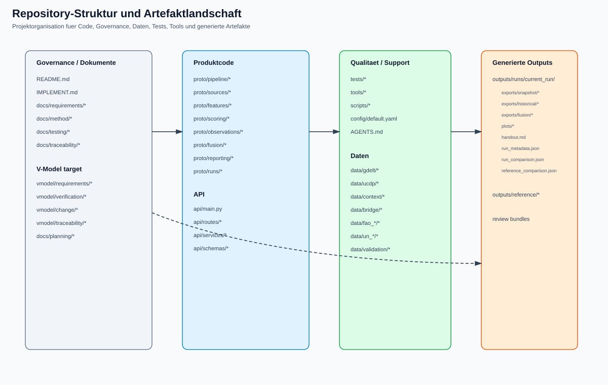
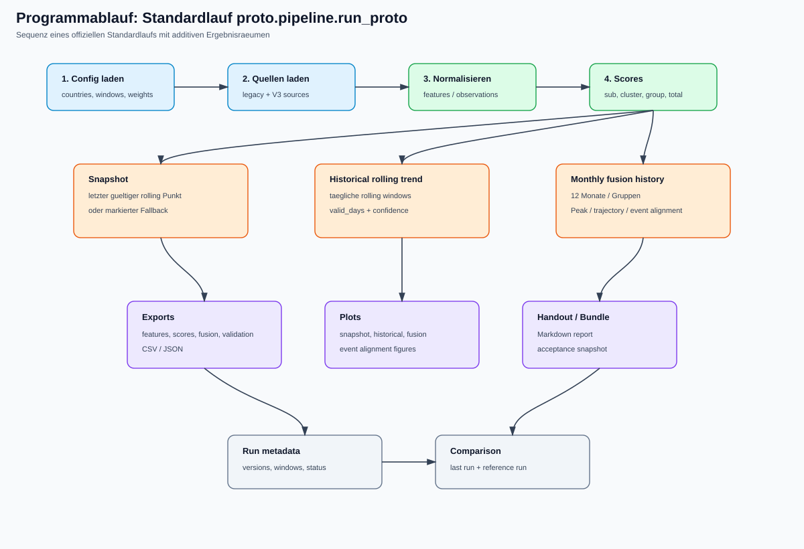
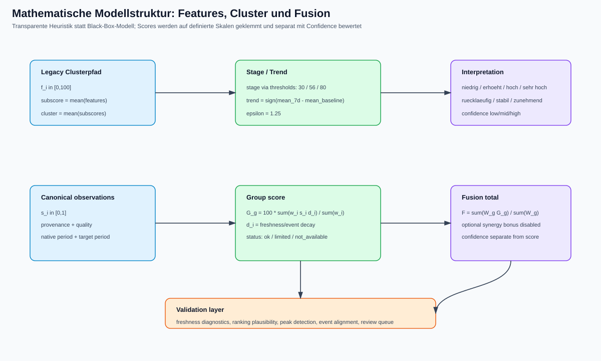
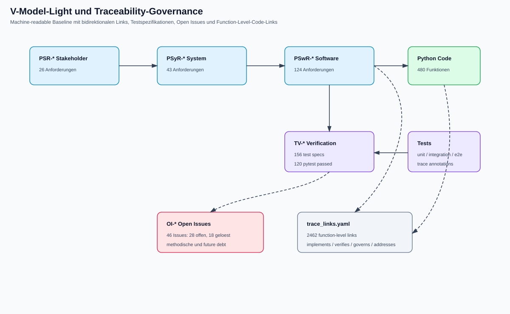

# Detaillierte Projektdokumentation: Country Destabilization Prototype

Stand: Branch `hermes/vmodel-assessment`, Commit-Kontext nach Function-Level-Traceability-Hardening.  
Zielgruppe: Engineering, Requirements/MBSD, Analyse-Methodik, Review und Weiterentwicklung.

## 1. Executive Summary

Der Country Destabilization Prototype ist ein requirements-getrieben entwickelter Analyseprototyp zur Erkennung kurzfristiger Auffaelligkeiten in Medien-, Ereignis- und Kontextdaten. Er soll moegliche Hinweise auf politische oder gesellschaftliche Destabilisierung sichtbar machen und analystenfreundlich aufbereiten. Das System ist kein operatives Warnsystem, keine vollautomatische Lagebewertung und kein Black-Box-ML-Modell. Es ist ein modularer, erklaerbarer und stark tracebarer Software-Prototyp, der heterogene Datenquellen in strukturierte Indikatoren, Plots, Exporte und Review-Artefakte ueberfuehrt.

Der aktuelle Stand kombiniert:

- einen klassischen Clusterpfad fuer `tension`, `escalation` und `vulnerability`,
- einen additiven V3+-Fusionpfad fuer `event`, `narrative`, `governance`, `market_food`, `shock`, `displacement`, `structural`,
- historische Rolling-Window-Bewertungen,
- monatliche historische Fusion,
- V4.3-Laenderprofile und Ranking-Trajektorien,
- V4.3.1 Peak-Hardening und Peak-Attribution,
- V4.3.2 Event-Alignment gegen eine Event-Registry,
- FastAPI-MVP-Endpunkte fuer Runs, Status und Artefakte,
- V-Model-Light-/Requirements-as-Code-Governance.

Der Prototyp ist aktuell sehr weit instrumentiert: 480 Python-Funktionen sind traceability-annotiert; `vmodel/traceability/trace_links.yaml` enthaelt 2462 Function-Level-Links; 156 Verification-Artefakte sind maschinenlesbar dokumentiert; die letzte vollstaendige Testausfuehrung ergab `120 passed`.

## 2. Ziel des Projekts

### 2.1 Fachliches Ziel

Das fachliche Ziel ist die Erkennung und Darstellung kurzfristiger Destabilisierungssignale. Der Prototyp soll Daten aus verschiedenen Quellen so verdichten, dass Analysten folgende Fragen effizienter bearbeiten koennen:

1. Gibt es aktuell auffaellige Signale fuer gesellschaftlich-politische Spannung?
2. Gibt es interne oder externe Eskalationsdynamik?
3. Gibt es strukturelle Verwundbarkeit, die akute Signale verstaerken kann?
4. Welche Laender zeigen im Vergleich erhoehte Fusion-Scores?
5. Welche Layer treiben eine Auffaelligkeit?
6. Ist ein Peak durch reale Ereignisse plausibel geerdet oder eher modell-/datengetrieben?
7. Wie belastbar ist ein Ergebnis hinsichtlich Quellenabdeckung, Aktualitaet, Vollstaendigkeit und Konsistenz?

### 2.2 Engineering-Ziel

Das Engineering-Ziel ist ein nachvollziehbarer, testbarer und weiterentwickelbarer Prototyp. Zentral ist die Trennung zwischen:

- Rohdaten,
- Features,
- Scores,
- Fusion- und Validation-Logik,
- Reporting,
- API,
- Governance.

Das Projekt folgt dem Grundsatz: Implementierung ist Evidenz, nicht Autoritaet. Anforderungen, Methodenregeln, Algorithmen, Tests und Code muessen tracebar bleiben.

### 2.3 Nicht-Ziele

Explizite Nicht-Ziele sind:

- keine autonome politische Entscheidungsmaschine,
- keine vollstaendige globale Echtzeitlage,
- keine Black-Box-Fusion,
- keine Aussage ueber Kausalitaet im strengen wissenschaftlichen Sinn,
- keine produktive Hochverfuegbarkeitsarchitektur,
- keine abschliessend kalibrierte Risiko- oder Prognosewahrscheinlichkeit.

## 3. Aktueller Stand in Zahlen

| Artefaktklasse | Stand |
|---|---:|
| Stakeholder Requirements | 26 |
| System Requirements | 43 |
| Software Requirements | 124 |
| Implementierte Software Requirements | 123 |
| Retired Software Requirements | 1 |
| Verification Specifications | 156 |
| Open Issues gesamt | 46 |
| Davon offen | 28 |
| Davon geloest | 18 |
| Function-Level Trace Links | 2462 |
| Python-Funktionen | 480 |
| Python-Klassen | 86 |
| Letzter Full-Test | 120 passed |

Wichtige Codebereiche:

| Bereich | Zweck | Groesse grob |
|---|---|---:|
| `proto/` | Kernpipeline, Quellen, Scoring, Fusion, Reporting | ca. 17k LOC |
| `api/` | FastAPI-MVP | ca. 1.3k LOC |
| `tests/` | Unit-/Integration-/End-to-End-nahe Tests | ca. 6.5k LOC |
| `tools/` | Review-Bundle, Frontend-/Support-Tools | ca. 1.5k LOC |
| `scripts/` | Scaffold-/Fixture-Generatoren | ca. 0.8k LOC |

## 4. Architekturuebersicht

Die Architektur ist in Schichten aufgebaut. Datenquellen und Konfiguration werden geladen, in interne Modelle ueberfuehrt, ueber Feature- und Observation-Pfade verdichtet, bewertet und schliesslich als Reports, Plots, Exporte und API-Artefakte bereitgestellt.



Ergaenzend zeigt die folgende Abbildung die organisatorische Repository-Struktur. Dadurch wird sichtbar, wie sich Produktcode, Governance-Artefakte, Tests, Tools, Daten und generierte Outputs zueinander verhalten.



### 4.1 Wichtige Packages

#### `proto.pipeline`

Zentrale Orchestrierung. `proto/pipeline/run_proto.py` fuehrt den Standardlauf aus. `proto/pipeline/config.py` validiert die Konfiguration und erzeugt typisierte Config-Objekte.

#### `proto.sources`

Quelladapter fuer GDELT, UCDP, Bridge, Context, FAO FFPI, FAO FPMA, UN Comtrade, GDACS, UNHCR, Narrative Input, Governance Input und GDELT Event.

#### `proto.features`

Feature-Builders fuer klassische Cluster:

- `gdelt_features.py`: Spannungssignale,
- `escalation_features.py`: Eskalationssignale,
- `vulnerability_features.py`: strukturelle Verwundbarkeit.

#### `proto.scoring`

Klassisches Scoring:

- `subscores.py`: Subscore-Bildung,
- `cluster_scores.py`: Aggregation zu Cluster-Scores,
- `thresholds.py`: Stage-Mapping,
- `trend.py`: 7d-vs-30d-Trendlogik,
- `confidence.py`: klassische Confidence,
- `trend_history.py`: historische Rolling-Window-Zeitreihen.

#### `proto.observations`

Kanonisches Observation-Schema und Normalisierung fuer neue Quellen. Hier wird die V3+-Quellvielfalt in ein gemeinsames internes Format gebracht.

#### `proto.fusion`

Multi-Source-Fusion, Freshness, Confidence und Validation. Besonders wichtig:

- `scoring.py`: Source Signals, Group Scores, Total Scores, Historical Fusion,
- `confidence.py`: getrennte Confidence-Logik,
- `freshness.py`: Freshness-Klassifikation und Decay,
- `validation.py`: Ranking-, Peak-, Event-Alignment- und Review-Diagnostik.

#### `proto.reporting`

Exports, Plots, Handout, Praesentationslogik. `handout.py` baut die laengere Markdown-Auswertung; `plots.py` erzeugt Snapshot-, Historical-, Fusion- und Event-Alignment-Plots.

#### `proto.runs`

Run-Metadaten, Vergleich mit vorherigem Lauf, Referenzlauf-Handling und Statuslogik.

#### `api/`

FastAPI-MVP fuer:

- `/health`,
- `/info`,
- Options und Config Template,
- Run-Erstellung,
- Run-Status,
- Run-Summary,
- Run-Artefakte,
- Bundle-/Artifact-Downloads.

## 5. Datenquellen und Eingangsdaten

Aktuelle Datenquellen im Repository:

| Quelle | Pfad | Rolle |
|---|---|---|
| GDELT | `data/gdelt/gdelt_events.csv` | Medien-/Eventsignale fuer Spannung und Event-Layer |
| UCDP | `data/ucdp/ucdp_events.csv` | Konflikt-/Gewaltereignisse |
| Bridge | `data/bridge/bridge_events.csv` | kuratierte Ereignisbruecke |
| Context | `data/context/country_context.csv` | strukturelle Kontextdaten |
| FAO FFPI | `data/fao_ffpi/fao_ffpi.csv` | Food price index / market_food |
| FAO FPMA | `data/fao_fpma/fao_fpma.csv` | Food price monitoring / market_food |
| UN Comtrade | `data/un_comtrade/un_comtrade.csv` | structural |
| GDACS | `data/gdacs/gdacs_events.csv` | shock |
| UNHCR | `data/unhcr/unhcr_displacement.csv` | displacement |
| Narrative Input | `data/narrative_input/narrative_input.csv` | narrative |
| Governance Input | `data/governance_input/governance_input.csv` | governance |
| Event Registry | `data/validation/event_registry.csv` | Event-Alignment |
| Reference Episodes | `data/validation/reference_episodes.csv` | Validierung / Plausibilitaet |

Die folgende Abbildung zeigt die inhaltliche Zuordnung der Quellen zu Layern und Gruppen des Fusionsraums.


Die Konfiguration liegt in `config/default.yaml`. Sie definiert Laender, Zeitfenster, historische Parameter, Versionen, Output-Pfade, Scoring-Schwellen, V3.1-Quellen, Gruppen, Gewichte, Confidence-Gewichte, Freshness-Modell und Event-Alignment-Schwellen.

## 6. Programmablauf



Der Standardlauf arbeitet in dieser Reihenfolge:

1. Konfiguration laden und validieren.
2. Rohquellen laden.
3. Klassische Features erzeugen.
4. Klassische Subscores und Cluster-Scores berechnen.
5. Stufen, Trends und Confidence ableiten.
6. Historische Rolling-Window-Zeitreihen berechnen.
7. Snapshot aus historischem gueltigem Endpunkt oder dokumentiertem Fallback ableiten.
8. Neue Quellen in kanonische Observations transformieren.
9. Fusion Source Signals bilden.
10. Group Scores und Fusion Total Score berechnen.
11. Historische monatliche Fusion erzeugen.
12. Validation-/Freshness-/Responsiveness-Diagnostik berechnen.
13. V4.3-Laenderprofile und Ranking-Trajektorien erstellen.
14. V4.3.1-Peaks, Peak-Attribution und Synchronisationsmetriken ableiten.
15. V4.3.2 Event-Alignment gegen Event-Registry berechnen.
16. Exporte und Plots schreiben.
17. Handout und Review-Artefakte erzeugen.
18. Run-Metadaten und Run-Status speichern.
19. Vergleich mit vorherigem Run und Referenzrun erzeugen.

## 7. Mathematische und heuristische Ansaetze



### 7.1 Feature- und Subscore-Skalen

Klassische Features werden auf `[0,100]` gefuehrt. Die Funktion `_clamp_score` begrenzt Werte auf diesen Bereich:

\[
clip_{0,100}(x) = \max(0, \min(100, x)).
\]

Die Subscore-Bildung nutzt einfache Mittelwerte. Beispiele:

- Spannung:
  - `protest_signal -> protest_subscore`,
  - `crisis_discourse_signal -> crisis_subscore`,
  - `negativity_signal -> negativity_subscore`,
  - optional `stability_signal -> stability_inverse_subscore = 100 - stability_signal`.

- Eskalation:
  - interne Dynamik aus `internal_violence_signal`, `repression_signal`, `domestic_attack_signal`,
  - externe Dynamik aus `war_activity_signal`, `external_attack_signal`, `regional_spillover_signal`,
  - Peak-Subscore als Maximum,
  - Intensity-Subscore als Mittel aus interner und externer Dynamik.

- Verwundbarkeit:
  - wirtschaftliche Verwundbarkeit,
  - hybride Verwundbarkeit,
  - Governance-Stress.

### 7.2 Cluster-Score

Ein Cluster-Score ist der einfache Mittelwert der Subscores:

\[
C_{c,k,t} = \frac{1}{n}\sum_{j=1}^{n} S_{c,k,j,t}.
\]

Die Wahl einer einfachen Aggregation ist bewusst: Sie ist erklaerbar, testbar und fuer einen Prototyp mit begrenzter Kalibriergrundlage robuster als eine schwer begruendbare komplexe Gewichtung.

### 7.3 Stage-Mapping

Der Standardwertsatz lautet:

- `score < 30`: niedrig,
- `30 <= score < 56`: erhoeht,
- `56 <= score < 80`: hoch,
- `score >= 80`: sehr hoch.

Formal:

\[
stage(C)=
\begin{cases}
low, & C < 30\\
elevated, & 30 \le C < 56\\
high, & 56 \le C < 80\\
very\ high, & C \ge 80.
\end{cases}
\]

### 7.4 Trendlogik

Der Trend vergleicht einen kurzfristigen Mittelwert gegen eine Baseline:

\[
\Delta = \overline{C}_{short} - \overline{C}_{baseline}.
\]

Mit `epsilon = 1.25` gilt:

- `Delta > epsilon`: zunehmend,
- `Delta < -epsilon`: ruecklaeufig,
- sonst stabil.

Der historische Pfad nutzt Rolling-Window-Logik mit `window_days=7`, `min_valid_days=5` und `aggregation=rolling_mean`.

### 7.5 Snapshot-Ableitung aus Historie

Der Snapshot wird nicht unabhaengig vom historischen Pfad berechnet. Stattdessen gilt folgende Prioritaet:

1. gueltiger Historical-Endpunkt am Run-Datum,
2. sonst letzter gueltiger Historical-Punkt vor Run-Datum,
3. sonst letzter numerischer Historical-Punkt unterhalb `min_valid_days`, explizit markiert und mit Confidence-Penalty,
4. sonst Raw-Fallback.

Diese Logik verhindert, dass Snapshot und historische Zeitreihe methodisch auseinanderlaufen.

### 7.6 Kanonische Observations

Der V3+-Pfad transformiert Quellen in `ObservationRecord`-Strukturen. Eine Observation enthaelt mindestens:

- `source_id`,
- `country`,
- `period_start`, `period_end`,
- `layer`,
- `signal_family`,
- `raw_value`,
- `normalized_value`,
- `unit`,
- `provenance`,
- `quality_completeness`,
- `native_periodicity`.

Die Normalisierung nutzt je nach Quelle z. B. `z_score`, `percentile` oder `baseline_deviation`.

### 7.7 Gruppenfusion

Fuer jede Gruppe `g` und jedes Land `c` werden aktuelle Source Signals selektiert. Der Gruppenwert ist:

\[
G_{c,g} = 100 \cdot \frac{\sum_i w_i \cdot s_i \cdot d_i}{\sum_i w_i}
\]

mit:

- `w_i`: Quellgewicht,
- `s_i`: normalisiertes Signal in `[0,1]`,
- `d_i`: Freshness-/Decay-Faktor.

Bei fehlenden Quellen wird der Gruppenstatus `not_available`; bei teilweiser Abdeckung `limited`; bei vollstaendiger erwarteter Abdeckung `ok`.

### 7.8 Fusion Total Score

Der Fusion Score aggregiert verfuegbare Gruppen:

\[
F_c = \frac{\sum_g W_g \cdot G_{c,g}}{\sum_g W_g}.
\]

Aktuelle Gruppengewichte:

| Gruppe | Gewicht |
|---|---:|
| event | 0.16 |
| narrative | 0.14 |
| governance | 0.15 |
| market_food | 0.18 |
| shock | 0.14 |
| displacement | 0.13 |
| structural | 0.10 |

Ein optionaler Bonus bei mehreren hohen Gruppen ist konfiguriert, aber aktuell deaktiviert. Das ist methodisch sinnvoll, solange die Synergieannahme nicht empirisch validiert ist.

### 7.9 Confidence

Confidence wird bewusst vom Score getrennt. Die Gruppen-Confidence kombiniert:

\[
Conf_g = \frac{
0.35 \cdot coverage +
0.25 \cdot recency +
0.25 \cdot completeness +
0.15 \cdot consistency
}{1.0}
\]

Die Total-Confidence nutzt analoge Komponenten und zieht Penalties ab:

- Dominanz-Penalty bei zu hohem Anteil einer einzelnen Gruppe,
- Limited-Penalty bei hohem Anteil limitierter Gruppen.

Qualitative Confidence-Level:

- `< 34`: niedrig,
- `< 67`: mittel,
- sonst hoch.

### 7.10 Freshness und Decay

Das Freshness-Modell klassifiziert Signale in `fresh`, `aging` und `stale`. Je Gruppe koennen eigene Parameter gesetzt werden, z. B. fuer Event sehr kurze Freshness-Fenster und fuer Structural sehr lange Fenster. Der Decay-Faktor reduziert veraltete Signale, ohne sie abrupt zu entfernen.

### 7.11 Validierung, Peaks und Event-Alignment

Die Validation-Schicht erzeugt keine absolute Ground Truth, sondern Plausibilitaets- und Review-Hilfen:

- Ranking-Plausibilitaet gegen erwartete Rangfolge,
- Episodenvergleich gegen Referenzepisoden,
- Layer-Dominanzdiagnostik,
- Freshness Coverage,
- historische Responsiveness,
- Laenderprofile ueber 356 Tage,
- Peak-Erkennung mit Prominenz, Rise/Fall und Mindestabstand,
- Peak-Attribution nach Event-Support, globalem Anteil, laenderspezifischem Anteil und Modellanteil,
- Event-Alignment gegen Event-Registry,
- Review Queue fuer Peaks ohne glaubwuerdiges Event-Match oder mit Mehrfachueberlappung.

### 7.12 Semantik und Interpretationsgrenzen der Scores

Die wichtigste methodische Leitplanke lautet: Ein Score ist im aktuellen Projektstand kein direkter Realwelt-Risiko- oder Prognosewert. Er beschreibt einen Modellzustand innerhalb eines definierten Beobachtungs- und Aggregationsschemas.

Fuer den klassischen Clusterpfad bedeutet das:

- Ein hoher Cluster-Score zeigt eine hohe aggregierte Signalstaerke innerhalb der modellierten Featurefamilien.
- Er zeigt nicht automatisch eine objektive oder kausal gesicherte Destabilisierung im politischen Sinn.
- Er ist stark davon abhaengig, welche Features in den Cluster aufgenommen wurden und wie gut diese Features die beobachtete Dynamik in der konkreten Situation repraesentieren.

Fuer den Fusionpfad gilt analog:

- Ein hoher Fusion-Score zeigt eine gewichtete Auffaelligkeit ueber mehrere Layer bei gegebener Freshness-, Coverage- und Decay-Logik.
- Er ist kein Wahrscheinlichkeitswert fuer Krieg, Regimekollaps oder gesellschaftlichen Umbruch.
- Er verdichtet heterogene Beobachtungen in einen gemeinsamen Ergebnisraum und muss deshalb immer zusammen mit Gruppenstatus, Layerbeitraegen und Confidence gelesen werden.

Wichtige Interpretationsmuster:

| Muster | Inhaltliche Bedeutung | Analystische Reaktion |
|---|---|---|
| hoher Score, hohe Confidence | starke Auffaelligkeit mit relativ guter Evidenzbasis | vertiefte inhaltliche Pruefung, Priorisierung fuer Review |
| hoher Score, niedrige Confidence | starke Auffaelligkeit bei lueckenhafter oder alternder Evidenz | vorsichtige Interpretation, Datenlage und dominante Quellen zuerst pruefen |
| niedriger Score, hohe Confidence | robuste Nicht-Auffaelligkeit im beobachteten Modell | Monitoring fortsetzen, keine Eskalation allein aus dem Score ableiten |
| niedriger Score, niedrige Confidence | wenig beobachtete Auffaelligkeit bei zugleich schwacher Datenbasis | nicht mit Entwarnung verwechseln; Coverage/Freshness separat betrachten |

Explizit unzulaessige Interpretationen sind:

- kausale Zuschreibungen allein aus dem Score,
- operative Policy- oder Sicherheitsentscheidungen ohne zusaetzliche menschliche Analyse,
- direkte Vergleichbarkeit mit externen Indizes ohne gemeinsame Kalibrierung,
- Gleichsetzung von `Confidence` mit inhaltlicher Wahrheit.

### 7.13 Vergleich von Clusterpfad und Fusionpfad

Beide Ergebnisraeume existieren bewusst parallel, weil sie unterschiedliche Staerken und Risiken haben.

| Aspekt | Clusterpfad | Fusionpfad |
|---|---|---|
| Primaerer Zweck | Kontinuitaet, einfache Lesbarkeit, robuste Kernsicht | breitere Multi-Source-Sicht mit staerkerer Diagnostik |
| Datenbasis | Legacy-Kernquellen und klassische Features | heterogene Quellbasis ueber kanonische Observations |
| Ergebnisraum | Spannung, Eskalation, Verwundbarkeit | `event`, `narrative`, `governance`, `market_food`, `shock`, `displacement`, `structural` plus Gesamtscore |
| Zeithorizont | Snapshot und rolling history | Snapshot und monatliche historische Fusion |
| Interpretierbarkeit | sehr hoch | hoch, aber komplexer wegen Layer-/Coverage-Logik |
| Robustheit gegen partielle Quellluecken | relativ hoch | gruppen- und layerabhaengig |
| Diagnostische Schaerfe | mittel | hoch bis sehr hoch |
| Hauptrisiko | Vereinfachung und begrenzte Quellbreite | Ueberkomplexitaet, Kalibrierungsdrift, dominante Einzelgruppen |

Faustregel fuer die Nutzung:

- Der Clusterpfad ist der bevorzugte Ergebnisraum fuer stabile, schnell lesbare Basisbeobachtung.
- Der Fusionpfad ist der bevorzugte Ergebnisraum fuer vertiefte Diagnose, Schichtanalyse, Quelltriangulation und Event-Grounding.
- Wenn beide Ergebnisraeume in dieselbe Richtung zeigen, steigt die analystische Plausibilitaet.
- Wenn beide deutlich divergieren, ist dies kein Fehlerindikator an sich, sondern ein Signal fuer erhoehte Review-Beduerftigkeit.

### 7.14 Unsicherheitsmodell und Datenqualitaetskette

Das Unsicherheitsmodell ist mehrstufig. Unsicherheit entsteht nicht erst am Ende bei der Anzeige von `Confidence`, sondern entlang der gesamten Verarbeitungskette.

1. Quellseitige Unsicherheit
   - Verfuegbarkeit einzelner Quellen,
   - zeitliche Latenz,
   - unvollstaendige Abdeckung,
   - semantische bzw. taxonomische Ambiguitaet.

2. Transformationsunsicherheit
   - Wahl der Normalisierung,
   - Mapping auf das kanonische Observation-Schema,
   - Verdichtung unterschiedlicher nativer Periodizitaeten,
   - Pflege von Gewichten, Schwellen und Layerzuordnungen.

3. Aggregationsunsicherheit
   - dominante Einzelquellen oder Einzelgruppen,
   - fehlende erwartete Gruppen,
   - alternde historische Punkte,
   - methodische Empfindlichkeit gegen Parameterwahl.

4. Ausgabeunsicherheit
   - starker Score trotz schwacher Confidence,
   - Alignment ohne eindeutiges Event-Grounding,
   - Peaks mit Mehrfachueberlappungen,
   - Review-Queue-Eintraege ohne klares Matching.

Die Systemlogik bildet diese Unsicherheit ueber mehrere Mechanismen ab:

- `quality_completeness` auf Observation-Ebene,
- Gruppenstatus wie `ok`, `limited`, `not_available`,
- Freshness-/Decay-Faktoren,
- getrennte Score- und Confidence-Fuehrung,
- Dominanz- und Limited-Penalties,
- Event-Alignment-Match-Klassen und Review-Queue.

Praktische Leseregeln fuer Analysten:

| Unsicherheitsmuster | Typische Ursache | Empfohlene Reaktion |
|---|---|---|
| hohe Auffaelligkeit, niedrige Confidence | wenige oder alternde dominante Quellen | Quellenlage, Freshness und Abdeckung zuerst pruefen |
| hohe Confidence, schwache Auffaelligkeit | breite, konsistente Nicht-Auffaelligkeit | als robuste Ruhephase interpretieren, aber externe Kontextpruefung beibehalten |
| starke Layer-Dominanz | einzelne Gruppe treibt Gesamtscore | auf Gruppen- und Source-Signals herunterbrechen |
| schwaches Event-Grounding | Peak ohne gutes Registry-Match | manuelle Fallpruefung und Event-Registry-Hardening priorisieren |

### 7.15 Methodische Grenzen und Gueltigkeitsbereich

Der Prototyp ist fuer kurzfristige Signalerkennung und analystische Review-Unterstuetzung gebaut. Das ist sein Gueltigkeitsbereich.

Abgedeckt werden insbesondere:

- heuristische, zeitnahe Sichtbarmachung auffaelliger Dynamiken,
- laendervergleichende Beobachtung innerhalb eines gemeinsamen Modells,
- nachvollziehbare Aggregation heterogener Quellen,
- technische und governance-seitige Reproduzierbarkeit.

Nicht oder nur eingeschraenkt abgedeckt werden:

- tiefe geopolitische Kausalmodelle,
- belastbare Langfristvorhersagen von Regime- oder Kriegspfaden,
- qualitative Akteursintentionen ohne strukturierte Inputs,
- normative oder operative Entscheidungsempfehlungen.

Methodische Grenzen je Layer:

- `event`: hohe zeitliche Naehe, aber stark registry- und coverage-abhaengig,
- `narrative`: potenziell sehr frueh sensitiv, aber semantisch taxonomie- und labelanfaellig,
- `governance`: nuetzlich fuer strukturelle Fragilitaet, aber schwach fuer sehr kurzfristige Dynamik,
- `market_food`: relevant fuer soziooekonomischen Druck, aber interpretativ kontextabhaengig,
- `shock` und `displacement`: wichtige Zusatzsicht, aber stark von externer Datenqualitaet und Periodizitaet abhaengig,
- `structural`: robuste Baseline, aber bewusst traege gegenueber kurzfristigen Ereignisimpulsen.

Deshalb gilt als zentrale Redlichkeitsregel:

> Score = modellierter Systemzustand unter gegebenen Annahmen, nicht Ground Truth.

Ebenso gilt fuer das Event-Alignment:

> Alignment = Plausibilitaets- und Grounding-Hinweis, nicht Beweis einer kausalen Erklaerung.

### 7.16 Evaluationsdesign fuer den naechsten Reifegrad

Fuer den Uebergang vom plausiblen Prototyp zu einem methodisch belastbareren Forschungs- oder Produktartefakt ist ein explizites Evaluationsdesign notwendig. Ein geeignetes Minimaldesign sollte vier Ebenen enthalten:

1. Signalqualitaet
   - Sind Peaks zeitlich plausibel?
   - Erkennen Cluster- und Fusionpfad bekannte Episoden?

2. Kalibrierung
   - Wie sensibel reagieren Ergebnisse auf Gewichte, Schwellen und Freshness-Parameter?
   - Wo entstehen stabile Rangfolgen, wo Parameterdrift?

3. Unsicherheitsguete
   - Korrelieren hohe Confidence-Werte mit besserem Event-Grounding und stabileren Ergebnisraeumen?
   - Signalisieren Penalties tatsaechlich problematische Datenlagen?

4. Analystische Nutzbarkeit
   - Verbessern Review-Queue, Layerdiagnostik und Handout die Bearbeitung realer Faelle?
   - Welche Darstellungen reduzieren Fehlinterpretationen?

Geeignete Evaluationsartefakte waeren:

- eine kuratierte Event- und Referenzepisodenbasis,
- annotierte Fallstudien fuer mehrere Laender und Zeitfenster,
- Parameter-Sweeps fuer Gewichte, Schwellen und Decay-Regeln,
- systematische Vergleichsauswertungen zwischen Clusterpfad und Fusionpfad,
- Review-Protokolle oder Expertenratings fuer interpretative Guete.

## 8. Output-Artefakte

Typische Output-Struktur:

```text
outputs/runs/current_run/
  run_metadata.json
  run_comparison.json
  reference_comparison.json
  handout.md
  exports/
    snapshot/
      features_export.csv
      scores_export.csv
      summary_export.json
      snapshot_status.json
    historical/
      historical_timeseries.csv
      historical_status.json
    fusion/
      observations.csv
      source_signals.csv
      group_scores.csv
      fusion_total_scores.json
      validation_summary.json
      validation_* .csv/json
  plots/
    snapshot/
    historical/
    fusion/
```

Der Handout ist das wichtigste menschlich lesbare Ergebnis. Er kombiniert Run Summary, Snapshot, historische Trends, Fusion-Uebersicht, Validierung, Laenderprofile, Peak-/Event-Alignment und Review-Hinweise.

## 9. API-MVP

Das API-MVP dient als Backend-Schicht fuer Frontend-/Integrationsszenarien. Es bietet:

- Health und Info,
- Options fuer Laender und Layer,
- Config Template,
- Run-Erstellung,
- Run-Status,
- Run-Details,
- Summary,
- Artefaktlisten,
- Bundle- und Artifact-Download.

Die API ist aktuell ein MVP. Spezialisierte Analysten-Endpunkte fuer Overview, Country Detail, Compare, Coverage und Artifacts sind als Weiterentwicklung sichtbar, aber noch nicht vollstaendig als dedizierte Backend-Contracts umgesetzt.

## 10. V-Model-Light / Requirements-as-Code



Die Governance-Struktur unter `vmodel/` ist inzwischen die massgebliche maschinenlesbare Zielstruktur fuer migrierte Artefakte. Sie enthaelt:

- `vmodel/requirements/stakeholder_requirements.yaml`,
- `vmodel/requirements/system_requirements.yaml`,
- `vmodel/requirements/software_requirements.yaml`,
- `vmodel/verification/test_specifications.yaml`,
- `vmodel/change/open_issues.yaml`,
- `vmodel/traceability/trace_links.yaml`.

### 10.1 Traceability-Regeln

Wichtige ID-Klassen:

- `PSR-*`: Stakeholder Requirements,
- `PSyR-*`: System Requirements,
- `PSwR-*`: Software Requirements,
- `PM-*`: Method Rules,
- `ALG-*`: Algorithms,
- `TV-*`: Test/Verification Artefacts,
- `OI-*`: Open Issues,
- `AP-*`: API-/Frontend-Handoff-Artefakte aus Legacy Traceability,
- `SUP-*`: Support-Scope-Artefakte.

Alle wichtigen Module, Funktionen und Tests tragen Traceability-Verweise. Die Function-Level-Traceability wurde automatisiert aus AST und Traceability-Kommentaren extrahiert.

### 10.2 Verifikationsstand

- 156 Verification Specifications sind als implementiert dokumentiert.
- 120 Tests wurden zuletzt erfolgreich ausgefuehrt.
- Python compile check war erfolgreich.
- Function-Level-Coverage: 480 Funktionen, 0 fehlende Annotationen, 0 unlinked unique function IDs.

## 11. Inhaltlicher aktueller Stand

### 11.1 Umgesetzte Faehigkeiten

- konfigurierbarer 10-Laender-Standardraum,
- klassische Clusterbewertung,
- Snapshot und historische Rolling Trends,
- Run-Metadaten,
- Run-Status,
- Run-Vergleich und Referenzvergleich,
- strukturierte Exporte,
- Plots,
- Handout,
- V3+-Observations und Fusion,
- Governance-, Narrative-, Event-, Shock-, Displacement-, Structural- und Market/Food-Layer,
- historische Monatsfusion,
- Validation Summary,
- Ranking- und Freshness-Diagnostik,
- Peak-Attribution,
- Event-Alignment,
- Review Queue,
- FastAPI-MVP,
- Review-Bundle-/Acceptance-Snapshot-Support,
- V-Model-Light-Governance.

### 11.2 Reifegrad-Einschaetzung

| Bereich | Reifegrad | Bemerkung |
|---|---|---|
| Kernpipeline | hoch fuer Prototyp | lauffaehig, getestet, modular |
| Klassisches Scoring | hoch fuer MVP | einfache transparente Heuristik |
| Fusionpfad | mittel-hoch | breit implementiert, Kalibrierung weiter offen |
| Validation/Event-Alignment | mittel | gute Diagnostik, aber Event-Registry/Empirie ausbauen |
| API | mittel | MVP vorhanden, dedizierte Read-Models offen |
| Frontend | ausserhalb dieser Kerndoku, aber vorbereitet | API-Gaps dokumentiert |
| Requirements Governance | hoch | YAML-Baseline, Tests, Trace Links vorhanden |
| Wissenschaftliche Validierung | niedrig-mittel | methodisch plausibel, aber keine abgeschlossene empirische Validierung |

## 12. Offene Punkte

### 12.1 Methodik und Kalibrierung

1. Gewichte und Schwellen sind transparent, aber noch nicht breit empirisch kalibriert.
2. Fusion Score ist ein heuristischer Index, keine Wahrscheinlichkeit.
3. Confidence-Komponenten sind plausibel, aber noch nicht gegen umfangreiche Ground-Truth-Datensaetze validiert.
4. Stage-Grenzen fuer Fusion und Cluster sollten mit Referenzepisoden und Expertenreview kalibriert werden.
5. Der optionale Multi-Group-Bonus ist bewusst deaktiviert; seine Aktivierung braucht eine belastbare methodische Begruendung.

### 12.2 Daten und Quellen

1. Event-Registry muss in Umfang, Qualitaet und Versionierung ausgebaut werden.
2. Narrative Inputs benoetigen perspektivisch eine semantische Governance: kontrollierte Taxonomie, Review-Regeln, Richtungsharmonisierung.
3. Governance Inputs benoetigen Quellen- und Aktualisierungsgovernance.
4. Historisierte Helper Sources koennten spaeter versioniert werden; aktuell gibt es eine bewusst konstante Baseline-Regel.
5. Laendernamen und Aliase muessen weiter robust normalisiert werden.

### 12.3 Produktisierung

1. Dedizierte API-Endpunkte fuer Overview, Country Detail, Compare, Coverage und Artifacts.
2. Persistente Run-Datenhaltung statt nur filesystem-basierter MVP-Struktur.
3. Authentifizierung und Rollenmodell fuer API/Frontend.
4. Deployment-Konzept fuer reproduzierbare Umgebungen.
5. Performance- und Skalierungstests fuer groessere Laender-/Quellenraeume.

### 12.4 Verifikation und Validierung

1. Erweiterung von Testdaten auf realistischere historische Szenarien.
2. Systematische Regression gegen eingefrorene Referenzruns.
3. Quantitative Evaluationsmetriken gegen externe Ereignisdaten.
4. Review-Prozess fuer False Positives / False Negatives.
5. Separate Validierung des Event-Alignment-Scorings.

### 12.5 Requirements/Governance

1. Open Issues weiter abarbeiten: aktuell 28 offen.
2. Branch-Baseline weiter stabilisieren und ggf. PR/Merge-Strategie definieren.
3. Legacy Markdown und YAML-Baseline konsistent halten oder Legacy explizit nur historisch einfrieren.
4. Requirement-Status fuer System- und Stakeholder-Layer weiter schaerfen: viele sind noch `candidate_baseline_requirement`, obwohl die Software-Layer stark implementiert sind.

## 13. Moegliche Weiterentwicklungspunkte

### 13.1 Methodische Roadmap

- Kalibrierpaket mit Referenzepisoden, Expertenlabels und Sensitivitaetsanalyse.
- Vergleich unterschiedlicher Aggregationsmodelle: Mittelwert, robustes Mittel, gewichtete Quantile, Bayesian score fusion.
- Formalisierte Unsicherheitsfortpflanzung zwischen Quellen-, Gruppen- und Total-Confidence.
- Explizite Trennung zwischen akutem Event-Risiko und strukturellem Baseline-Risiko.
- Counterfactual-/Ablation-Reports: Wie veraendert sich der Score ohne eine Gruppe?

### 13.2 Software-Roadmap

- API Read Models fuer alle Frontend-Sichten.
- Persistenzschicht fuer Runs, Artefakte und Traceability Snapshots.
- CLI fuer Standardlauf, Validierung, Bundle-Erzeugung und Baseline-Vergleich.
- Automatische Generierung einer Trace-Matrix aus YAML + Function Links.
- CI-Gates fuer Traceability-Coverage, YAML-Konsistenz und Full-Test-Suite.

### 13.3 Analyse- und UX-Roadmap

- Analyst Dashboard mit Overview, Country Detail, Compare, Coverage, Artifacts.
- Interaktive Peak-/Event-Alignment-Review.
- Drilldown von Fusion Total Score auf Gruppen, Quellen und Einzelbeobachtungen.
- Confidence-Erklaerung je Score.
- Exportierbare Executive Summaries.

### 13.4 Governance-Roadmap

- Change-Request-Prozess fuer neue Anforderungen.
- Review-Gates fuer neue Quellen und neue Algorithmen.
- Requirements-basierte Akzeptanzkriterien pro Work Package.
- Versionierte Method Baselines.
- Abnahmeprotokoll fuer jede signifikante Baseline-Aenderung.

## 14. Empfehlung fuer die naechsten Arbeitspakete

1. **WP-A: API Read Model Hardening**  
   Dedizierte Backend-Endpunkte fuer Overview, Countries, Compare, Coverage und Artifacts einfuehren.

2. **WP-B: Evaluation Dataset Baseline**  
   Referenzepisoden und Event-Registry systematisch erweitern, inklusive Expertenlabels und erwarteter Signatur.

3. **WP-C: Method Calibration Report**  
   Sensitivitaetsanalyse fuer Gewichte, Schwellen, Freshness, Event-Alignment und Dominanz-Penalties.

4. **WP-D: Governance Cleanup**  
   Offene OI-Liste priorisieren, Stakeholder/System-Requirement-Status schaerfen, Trace-Matrix-Generator aus Function Links bauen.

5. **WP-E: Frontend/API Integration**  
   Analysten-Dashboard gegen stabile API-Vertraege anbinden und Fallback-Pfade abbauen.

## 15. Kurzfazit

Das Projekt steht aktuell auf einem starken Prototyp-Reifegrad: Die Software ist modular, getestet, tracebar und inhaltlich breit ausgebaut. Der groesste Wert liegt in der Kombination aus erklaerbarer Analyseheuristik und strenger Engineering-Governance. Die groessten Risiken liegen nicht mehr primaer in fehlender Implementierung, sondern in fachlicher Kalibrierung, Daten-/Event-Governance, Produktisierung und wissenschaftlicher Validierung.
